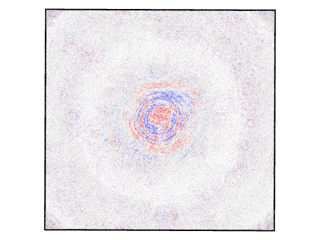
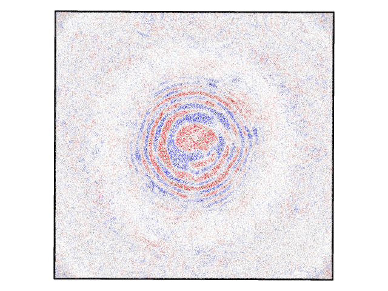

# Large Scale Molecular Dynamics Visualization

## The Data
I am simulating mechanical surface waves in 2D sheets of a particular 2D material called MXenes.
The sheets are perturbed which produces a mechnical wave that can be seprated from the background
thermal motion and rippling. 

See two snap shots of the atomic system color coordinated by atomic dispalcement from the background.

## The Challenge
These simulations are millions of atoms and use a very high data export frequency, ~5 simulated picoseconds, to
get dense enough data to measure the shape and behaviour of these waves. That is too much data to send to a local machine to process. It would also take a significant ammount of time to process in serial to generate good visualizations. The visualizations are not strictly necessary to the analysis of this data but they will be necessary to present this work. As a point of reference, just exctracting the atomic displacemetns from the raw data files takes 30 min on 16 cores using 
an mpi implementation of python using all vector based arithmatic. C will be significantly faster but generating visualizations
in serial will still take for too long.
I would like to generate videos of the wave propegation.

## The Solution
My implementation will be carried out in 3 steps.

1. A working serial C implementation, starting from atom.c given by Dr. Nanakano, to be testd on smaller scale simulations.

2. A hybrid MPI + OpenMP implementaion of the working serial code

3. Depending on the success and timelines of the first two, I want to implement the space filling curve and culling procedures

This is not curently intended to be an in-situ visualization package, the data is being generated with the LAMMPS package and
this would need to integrated with LAMMPS, which is open-source, or I would need to write my own implementation of the complex potential being used here. 
